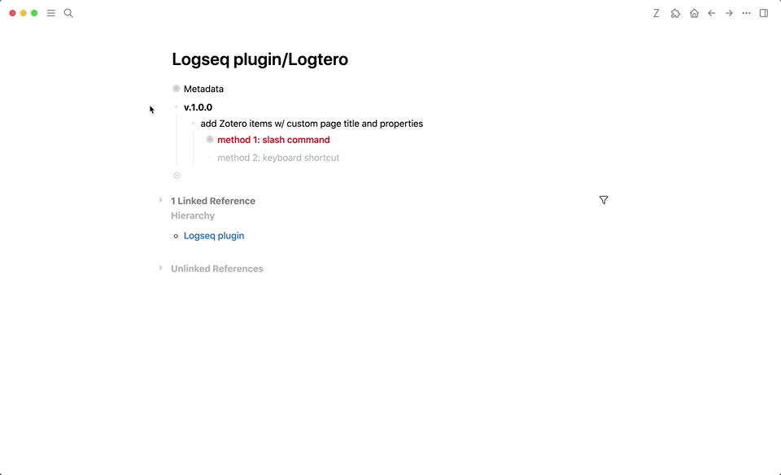
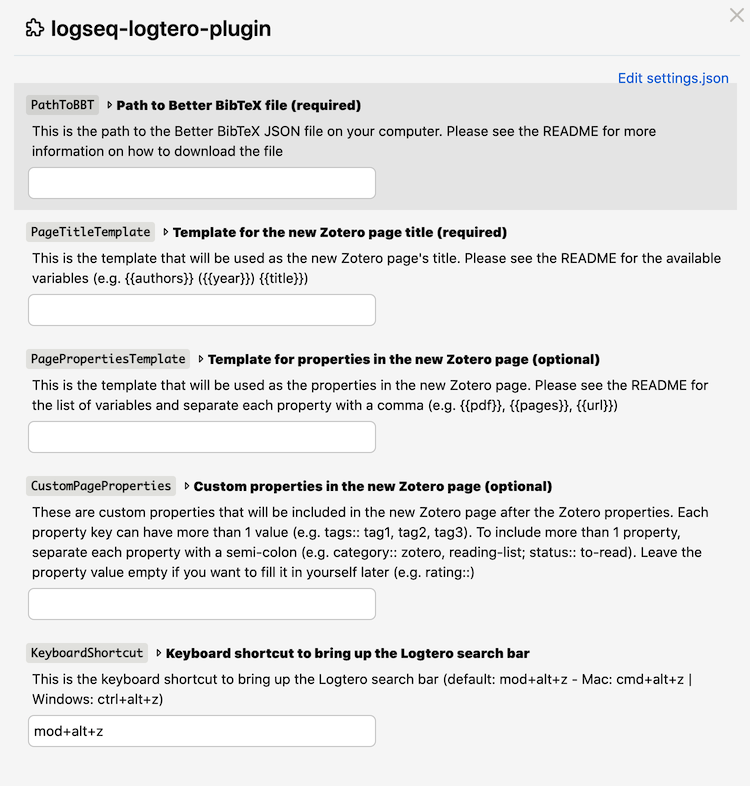

## logseq-logtero-plugin
> If you find this plugin – or any of my other [Logseq plugins](https://github.com/vyleung?tab=repositories&q=logseq&type=source) – useful and would like to support me, you can [buy me a coffee](https://www.buymeacoffee.com/vyleung) 🙂

## Features
### Create a page for Zotero with a custom title and page properties
#### Demo

## Instructions
### Step 1: Install the [Better BibTeX plugin for Zotero](https://github.com/retorquere/zotero-better-bibtex)
> [Additional help for installing the Better BibTeX plugin](https://retorque.re/zotero-better-bibtex/installation/)
- Download the [latest release](https://github.com/retorquere/zotero-better-bibtex/releases/latest) of Better BibTeX from Github
- Open Zotero → Select `Tools` in the menu bar → `Add-ons`
- In the `Add-ons Manager`, select the gear icon at the top right corner → Select `Install Add-on From File`
- Select the `.xpi` file downloaded from Github → Restart Zotero
### (Optional): Customize the Better BibTeX Zotero plugin settings
- Open Zotero → Select `Zotero` in the menu bar → `Preferences` → Select the `Better BibTeX` tab
- For information about the setting sections, [click here](https://retorque.re/zotero-better-bibtex/installation/preferences/)
    - Example: In the `Citations keys` tab, edit citation key format ([click here](https://retorque.re/zotero-better-bibtex/citing/#generating-citekeys) for a list of available functions)
- After adjusting the plugin settings:
    - Go to your library or specific collection(s) → Click on the first item → Select all items using the keyboard shortcut (Mac: `cmd+a` | Windows: `ctrl+a`)
    - Right-click on any item → Select `Better BibTeX` → Select `Refresh Better BibTeX key` → Check on the progress at the top right corner for `BetterBibTeX JSON`

### Step 2: Export Zotero library in the BetterBibTeX JSON format
- Open Zotero → Select `File` in the menu bar → Select `Export Library`
    - For the format, select `BetterBibTeX JSON`
    - For the translator options, select `Export Notes` and `Keep updated` → Select `Ok` → Rename file (e.g. `zotero_BBT`) and select `Save`
- To confirm the export, go to the plugin settings (Open Zotero → Select `Zotero` in the menu bar → `Preferences` → Select the `Better BibTeX` tab)
    - Select the `Automatic export` tab → At the bottom, find `Output file:` and copy the file path to the BetterBibTeX JSON file (e.g. `/Users/.../zotero_BBT.json`)

### Step 3: Install and configure the Logtero plugin in Logseq
#### [Installation](#installation)
#### Logtero configuration
- After installing and locating the Logtero plugin, select the gear icon at the bottom left corner → Select `Open settings`
    - In the `PathToBBT` section, paste the file path to the BetterBibTeX JSON file
    - In the `PageTitleTemplate`, use any of the following placeholders:
        - {{authors}}
        - {{citekey}}
        - {{title}}
        - {{year}}
    - In the `PagePropertiesTemplate`, and `CustomPagePropertiesTemplate` sections, use any of the following placeholders:
        - {{abstractNote}}: the abstract of the item
        - {{authors}}: includes all authors, editors, contributors, etc associated with the item
        - {{collection}}: the Zotero collection the item is in
        - {{citekey}}: the citekey of the item
        - {{doi}}: the DOI of the item
        - {{filePath}}: the file path of the item
        - {{issue}}: the issue of the journal the item is in
        - {{itemType}}: the type of item it is (e.g. book, journal article, conference paper)
        - {{journal}}: the journal the item is in
        - {{keywords}}: the keywords associated with the item in Zotero
        - {{localLibrary}}: the local link to the item in library (e.g. `zotero://select/library/items/...`)
        - {{pages}}: the pages of the item
        - {{pdf}}: format - ``
        - {{title}}: the title of the item
        - {{url}}: the original link to the item
        - {{volume}}: the volume of the journal the item is in
        - {{webLibrary}}: the web link to the item in library (e.g. `http://zotero.org/users/.../items/...`)
        - {{year}}: the publication year of the item
        ---
        - Example templates
            - Page title: `{{authors}} ({{year}}) {{title}}` → `Allen (2001) Getting Things Done`
            - Page properties: `{{itemType}}` → `itemType:: book`
            - Custom page properties: `category:: zotero, recommended; status:: to-read; rating::`
### Step 4: Using the Logtero plugin
#### Add a Zotero item in 3 ways:
- To mirror the behavior of the native Zotero integration in Logseq (insert pdf in the block), use the slash command (type `/logtero`)
- To open the page after selecting a Zotero item, use either:
    - Keyboard shortcut (can be configured in the [settings](#settings))
    - Command palette 
        - Activate it using the default keyboard shortcut (Mac: `cmd+shift+p` | Windows: `ctrl+shift+p`) → Type `logtero`)
            - The keyboard shortcut can be configured in Logseq:
                - Click the 3 dots in the righthand corner → Select `Settings` → At the bottom of the `General` tab, select `Customize shortcuts`
                - Scroll all the way down to the `Others` section → Find `Toggle command palette` → Click on the shortcut to change it → Click `Save`

## Installation
### Preparation
1. Click the 3 dots in the righthand corner → `Settings` → `Advanced` → Enable `Developer mode` and `Plug-in system`
2. Click the 3 dots in the righthand corner → `Plugins` – OR – Use keyboard shortcut `Esc t p`

### Load plugin via the marketplace (not available yet)

### Load plugin manually
1. Download the [latest release](https://github.com/vyleung/logseq-logtero-plugin/releases/latest) of the plugin (e.g logseq-logtero-plugin-v.1.0.0.zip) from Github
2. Unzip the file
3. Navigate to plugins (Click the 3 dots → `Plugins` – OR – Use keyboard shortcut `Esc t p`) → `Load unpacked plugin` → Select the folder of the unzipped file

## Settings
- Each time you make changes to the plugin settings, please refresh Logseq to ensure that all settings are updated  

## License
MIT

## Credits
- Plugin Marketplace Icon: [Logseq icon](https://github.com/logseq/logseq/blob/master/resources/icon.png) + [Zotero icon](https://www.zotero.org/support/_media/logo/zotero_256x256x32.png)
- Plugin Toolbar Icon: [Tabler Icons](https://tablericons.com/)
- Plugin concept inspiration: [Obsidian BibNotes Formatter plugin](https://github.com/stefanopagliari/bibnotes)
- Plugin name inspiration: [Notero plugin for Zotero](https://github.com/dvanoni/notero) (syncs Zotero items to Notion)